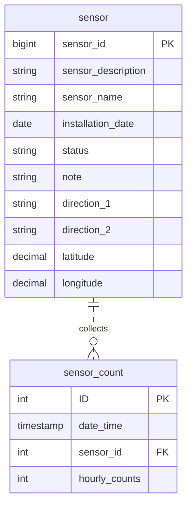

# mel_aus_pedestrian_sensor

## Data analysis and preparation
### sensor dataset
Initial import into an RDBMS was to a staging table with all varchar fields to allow analysis of data:
```
create table sensor_stg(
    sensor_id VARCHAR(400)
    ,sensor_description VARCHAR(400)
    ,sensor_name VARCHAR(400)
    ,installation_date VARCHAR(400)
    ,status VARCHAR(400)
    ,note VARCHAR(400)
    ,direction_1 VARCHAR(400)
    ,direction_2 VARCHAR(400)
    ,latitude VARCHAR(400)
    ,longitude VARCHAR(400)
    ,location VARCHAR(400)
)

LOAD DATA LOW_PRIORITY LOCAL INFILE 'Pedestrian_Counting_System_-_Sensor_Locations.csv' INTO TABLE `mel_aus_foot_traffic`.`sensor_raw` CHARACTER SET utf8 FIELDS TERMINATED BY ',' OPTIONALLY ENCLOSED BY '"' LINES TERMINATED BY '\n' IGNORE 1 LINES (`sensor_id`, `sensor_description`, `sensor_name`, `installation_date`, `status`, `note`, `direction_1`, `direction_2`, `latitude`, `longitude`, `location`);

```

- sensor_id appears to be the record identifier, location attribute unnecessary as it's a repeat of latitude and longitude fields.
- status field values would need to be confirmed with data steward and a lookup table implemented
- if sensor_ids are all numeric, would potentially be more efficient for query performance and storage to store as integer
- installation_date, latitude and longitude would be stored as date and decimal(12,9) provided they pass datatype conversions, these datatypes would be more efficient for querying and usage for date/GIS functions.
- Regular ETL would import the data and any records failing datatype conversion would be written to an error log

#### Data type/primary key testing:
sensor_id uniqueness:
```
--Returns 0 records - field is unique

SELECT sensor_id
FROM sensor_stg
GROUP BY sensor_id
HAVING COUNT(*) > 1
```

data type validations:
```
--No errors, proposed datatypes are acceptable

SELECT CAST(sensor_id AS INTEGER), CAST(installation_date AS DATE), CAST(latitude AS DECIMAL(12,9)), CAST(longitude AS DECIMAL(12,9))
FROM sensor_stg
```

#### Load to final table
varchar(400) fields could be reduced in size for storage efficiency, but for this exercise they have been left as is
```
CREATE TABLE sensor AS
SELECT
	CAST(sensor_id AS INTEGER) AS sensor_id
	,sensor_description
	,sensor_name
	,CAST(installation_date AS DATE) AS installation_date
	,status
	,note
	,direction_1
	,direction_2
	,CAST(latitude AS DECIMAL(12,9)) AS latitude
	,CAST(longitude AS DECIMAL(12,9)) AS longitude
FROM sensor_stg
```
---
### sensor counts dataset
Initial import into an RDBMS was to a staging table with all varchar fields to allow analysis of data:
```
create table sensor_counts_stg(
    ID VARCHAR(400)
    ,Date_Time VARCHAR(400)
    ,YEAR VARCHAR(400)
    ,MONTH VARCHAR(400)
    ,Mdate VARCHAR(400)
    ,DAY VARCHAR(400)
    ,TIME VARCHAR(400)
    ,Sensor_ID VARCHAR(400)
    ,Sensor_Name VARCHAR(400)
    ,Hourly_Counts VARCHAR(400)
)

LOAD DATA LOW_PRIORITY LOCAL INFILE 'Pedestrian_Counting_System_-_Monthly__counts_per_hour_.csv' INTO TABLE `mel_aus_foot_traffic`.`sensor_counts_stg` CHARACTER SET utf8 FIELDS TERMINATED BY ',' OPTIONALLY ENCLOSED BY '"' LINES TERMINATED BY '\n' IGNORE 1 LINES (`ID`, `Date_Time`, `YEAR`, `MONTH`, `Mdate`, `DAY`, `TIME`, `Sensor_ID`, `Sensor_Name`, `Hourly_Counts`);
```

- ID appears to be the record identifier - check for duplicates. Regular ETL would check for duplicates and potentially write to an error file to be checked whether record is an update to an existing record, etc. bigint rather than int is best, as int may not be large enough if the number of records is huge
- YEAR, MONTH, Mdate, DAY, TIME appear unnecessary - Date_Time field cast as timestamp will more efficiently store all required information
- Sensor_ID is our foreign key to sensor table. Regular ETL would perform checks to ensure that all Sensor_IDs in this dataset are matched to sensor_ids in sensor table. 
- Sensor_Name is unnecessary as it can be derived from sensor table. Check whether some sensor_count records do not align with sensor table. If the name changes over time, we could do some further analysis and capture name changes in a history table or make the sensor table a slowly-changing dimension table. 
- Ensure Hourly_Counts column is numeric

#### Data type/primary key testing:
ID uniqueness:
```
--Returns 0 records - field is unique

SELECT ID
FROM sensor_counts_stg
GROUP BY ID
HAVING COUNT(*) > 1
```
Date_Time datatype conversion check:
```
--No errors returned, datatype convesion OK

SELECT STR_TO_DATE(Date_Time , '%M %d, %Y %h:%i:%s %p') AS date_time
FROM sensor_counts_stg
GROUP BY STR_TO_DATE(Date_Time , '%M %d, %Y %h:%i:%s %p')
```
Sensor_Name checks:
```
--Name has changed over time - possibly create a history table or SCD type 2 or analyse to confirm that id and . For now, ignore sensor_name

SELECT sensor_id FROM (
SELECT DISTINCT sensor_id, sensor_name
FROM sensor_counts_stg
) A
GROUP BY sensor_id
HAVING COUNT(*)>1
```

All sensor_ids in sensor_count_stg exist in sensor table
```
--No rows returned

SELECT sensor_id
FROM sensor_counts_stg A
WHERE NOT EXISTS (
    SELECT NULL
    FROM sensor B
    WHERE A.sensor_id = B.sensor_id
)
GROUP BY sensor_id
```

Other Datatype conversion checks - Hourly_Counts column on visual inspection contains commas, so perform a replace to remove commas prior to casting as integer:
```
--All rows converted successfully

SELECT
	CAST(ID AS INTEGER) AS id
	,CAST(sensor_id AS INTEGER) AS sensor_id
	,CAST(REPLACE(Hourly_Counts,',','') AS INTEGER) AS hourly_counts
FROM sensor_counts_stg
```

#### Load to final table
```
CREATE TABLE sensor_counts AS
SELECT
	CAST(ID AS INTEGER) AS id
	,STR_TO_DATE(Date_Time, '%M %d, %Y %h:%i:%s %p') AS date_time
	,CAST(sensor_id AS INTEGER) AS sensor_id
	,CAST(REPLACE(Hourly_Counts,',','') AS INTEGER) AS hourly_counts
FROM sensor_counts_stg
```


# Entity-Relationship diagram

# Analysis queries
## Top 10 (most pedestrians) locations by day
```
#Top 10 (most pedestrians) locations by day
SELECT *
FROM (
	SELECT A.sensor_id, B.sensor_description, A.`date`, A.daily_count, ROW_NUMBER() OVER (PARTITION BY A.`date` ORDER BY daily_count DESC) AS Row_Num
	FROM (
		SELECT sensor_id, CAST(date_time AS DATE) AS `date`, SUM(hourly_counts) AS daily_count
		FROM sensor_counts
		GROUP BY sensor_id, CAST(date_time AS DATE)
	) A
	JOIN sensor B
     ON A.sensor_id = B.sensor_id
) C
WHERE Row_Num <= 10
ORDER BY `date`, Row_Num
```


## Top 10 (most pedestrians) locations by month
```
#Top 10 (most pedestrians) locations by month
SELECT *
FROM (
	SELECT A.sensor_id, B.sensor_description, A.`month`, A.monthly_count, ROW_NUMBER() OVER (PARTITION BY A.`month` ORDER BY monthly_count DESC) AS Row_Num
	FROM (
		SELECT sensor_id, LAST_DAY(date_time) AS `month`, SUM(hourly_counts) AS monthly_count
		FROM sensor_counts
		GROUP BY sensor_id, LAST_DAY(date_time)
	) A
	JOIN sensor B
     ON A.sensor_id = B.sensor_id
) C
WHERE Row_Num <= 10
ORDER BY `month`, Row_Num
```

# Which location has shown most decline due to lockdowns in last 2 years
```
#Most decline in last 2 years since lockdown
#Take 2019 monthly figures as baseline and take an average of the percentage of current traffic vs baseline
#Order by and limit clause at end of query will return sensor with lowest percentage of current traffic vs baseline.

#Result was sensor_id = 9 (Southern Cross Station)

SELECT base.sensor_id, AVG(future.monthly_count_avg/base.monthly_count) AS percent_of_prelockdown_avg
FROM (
SELECT sensor_id, MONTH(date_time) AS `month`, SUM(hourly_counts) AS monthly_count
FROM sensor_counts
WHERE YEAR(date_time) = 2019
GROUP BY sensor_id, MONTH(date_time)
) base
JOIN (
	SELECT sensor_id, `month`, AVG(monthly_count) AS monthly_count_avg
	FROM (
		SELECT sensor_id, MONTH(date_time) AS `month`, YEAR(date_time), SUM(hourly_counts) AS monthly_count
		FROM sensor_counts
		WHERE YEAR(date_time) > 2019
		AND date_time < '2021-08-01'
		AND date_time >= '2020-03-01'
		GROUP BY sensor_id, MONTH(date_time), YEAR(date_time)
	) months
	GROUP BY sensor_id, `month`
) future
  ON base.sensor_id = future.sensor_id
  AND base.`month` = future.`month`
GROUP BY base.sensor_id
ORDER BY AVG(future.monthly_count_avg/base.monthly_count)
LIMIT 1
```

# Which location has most growth in last year
```
#Most growth in last year
#Take June 2020 to July 2021 as baseline, June 2021 to July 2022 as future (assuming August 2022 is incomplete)

#Result was sensor_id = 54 (Lincoln-Swanston (West))

SELECT base.sensor_id, AVG(future.monthly_count/base.monthly_count) AS percent_yoy_avg
FROM (
SELECT sensor_id, MONTH(date_time) AS `month`, SUM(hourly_counts) AS monthly_count
FROM sensor_counts
WHERE date_time BETWEEN '2020-06-01 00:00:00' AND '2021-07-31 23:59:59'
GROUP BY sensor_id, MONTH(date_time)
) base
JOIN (
	SELECT sensor_id, MONTH(date_time) AS `month`, SUM(hourly_counts) AS monthly_count
	FROM sensor_counts
   WHERE date_time BETWEEN '2021-06-01 00:00:00' AND '2022-07-31 23:59:59'
	GROUP BY sensor_id, MONTH(date_time)
) future
  ON base.sensor_id = future.sensor_id
  AND base.`month` = future.`month`
GROUP BY base.sensor_id
ORDER BY AVG(future.monthly_count/base.monthly_count) DESC
LIMIT 1
```
